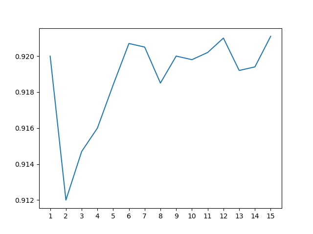
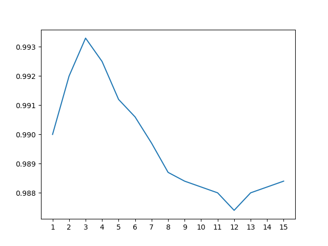
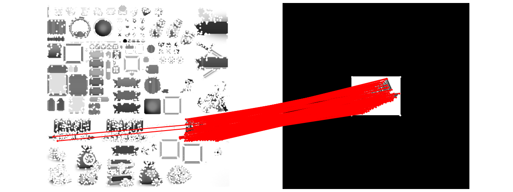
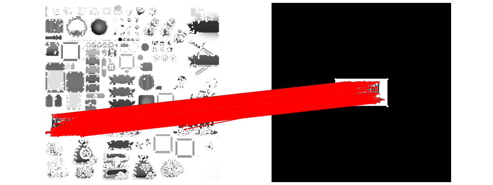
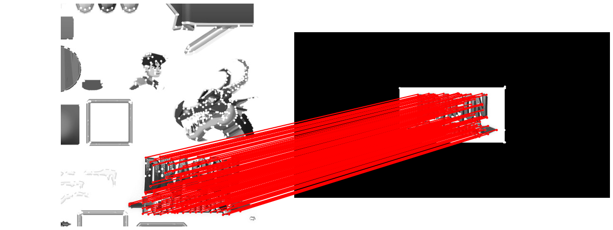
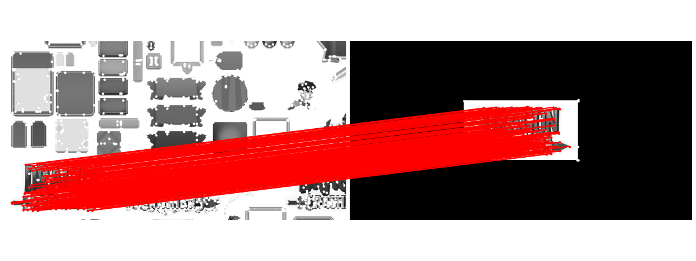
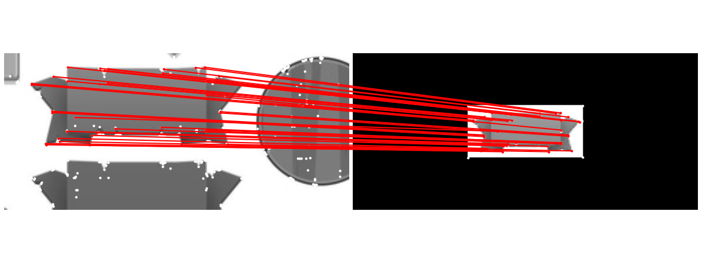
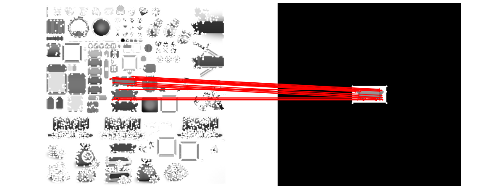
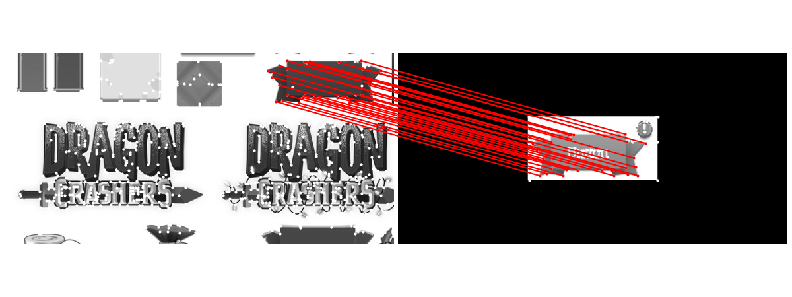

## Introduction
This repo contains a pretrained SuperPoint network and a pretrained SuperGlue network. The combination of two neural networks is used to do template matching between an image and a game asset. Prediction about whether this image belongs to the game asset will be made based on the matching result.

SuperPoint here operates as the "front-end," detecting interest points and computing their accompanying descriptors.  For more details please see:
* Full paper PDF: [SuperPoint: Self-Supervised Interest Point Detection and Description](https://arxiv.org/abs/1712.07629)

SuperGlue here operates as the "middle-end," performing context aggregation, matching, and filtering in a single end-to-end architecture. For more details, please see:
* Full paper PDF: [SuperGlue: Learning Feature Matching with Graph Neural Networks](https://arxiv.org/abs/1911.11763).

Two thresholds are used to operate as the "back-end", making prediction based on the results from superglue.

## Evaluation Result

Recall = 92.1% (based on 7500 pos instances)

  

Specificity = 98.8% (based on 7500 neg instances)

  

Approximated accuracy  ≈ 97.1% (based on 7500 pos instances and 22500 neg instances)

Example matches on real case:

  

  

  

  

  

  

  

