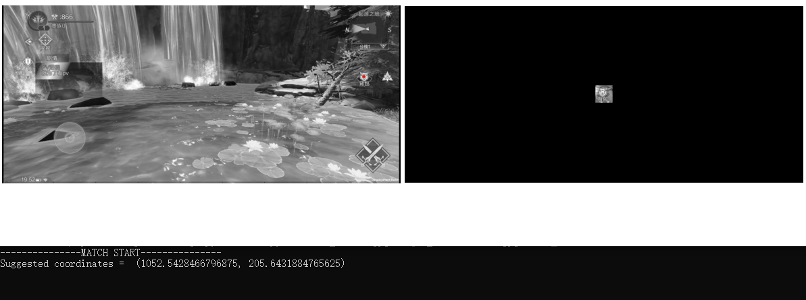
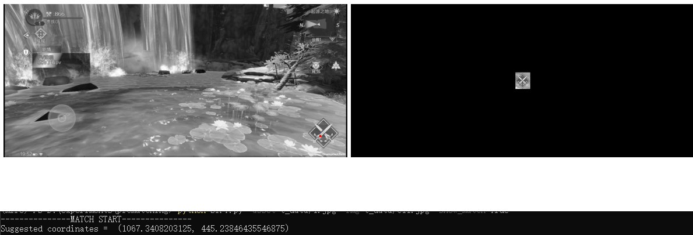

## Introduction
This repo contains an algo used to do feature matching. 

Architecture of the algo:  
Tuned SIFT + FLANN + Z-Score Iteration

Tuned SIFT here operates as the "front-end," detecting interest points and computing their accompanying descriptors.Unlike the original version of SIFT, it performs better in game asset keypoint detection and it's clip-invariant. 

FLANN here operates as the "middle-end," performing fast keypoint matching.  

Z-SCore Iteration here operates as the "back-end", detecting outliers and discarding them iteratively.

## Dependencies
* Python 3 >= 3.10
* Pandas >= 1.5.2
* OpenCV >= 4.6
* Matplotlib >= 3.6
* NumPy >= 1.23


## Matching
Single pair matching
```
python SIFT.py -asset ASSET_PATH -img IMG_PATH -show_match True
```
Batch matching
```
python SIFT.py -batch CSV_FILE
```

## Evaluation Results

Recall = 89.1% 


## Example matches on real cases
<p align="center">
  
</p>
<p align="center">
  
</p>
<p align="center">
  
</p>

